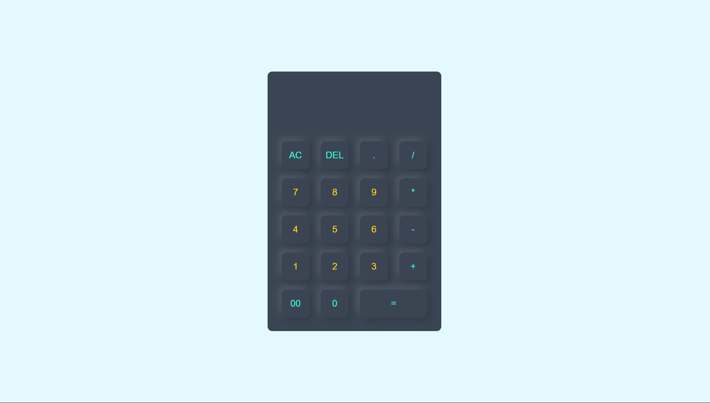

---

CALCULATOR

# Modern Neumorphic Calculator

A sleek, responsive calculator web application built using **HTML5**, **CSS3**, and **Vanilla JavaScript**. This project features a modern **Neumorphic design** (soft UI) with interactive hover effects and core mathematical functionality.

---

## Calculator Preview




##  Features

*   **Neumorphic UI:** Soft shadows and a dark-themed interface for a modern aesthetic.
*   **Core Arithmetic:** Supports addition, subtraction, multiplication, and division
*   **Real-time Display:** Dynamic input display for numbers and operators.
*   **Special Functions:** Includes an "AC" (All Clear) button and a "DEL" (Delete) button for character-by-character correction.
*   **Responsive Interaction:** Inset shadow effects on button hover for a tactile feel.

---

##  Built With

*   **HTML5:** Structured the calculator layout using semantic elements and a form-based input system.
*   **CSS3:** Styled with Flexbox for centering and custom box-shadows to achieve the Neumorphic look.
*   **JavaScript:** Implemented logic using the `eval()` function for quick calculations and DOM manipulation via `onclick` events.


---

##  Project Structure
```text
├── index.html   # Markup and inline JS logic
├── style.css    # Custom Neumorphic styling
└── README.md    # Project documentation

## ⚙️ How to Run

1.  **Clone the repository:**
    ```bash
    git clone [https://github.com/your-username/your-repo-name.git](https://github.com/your-username/your-repo-name.git)
    ```
2.  **Navigate to the project folder:**
    ```bash
    cd your-repo-name
    ```
3.  **Open the app:**
    Simply double-click `index.html` to view it in your preferred web browser.

---
